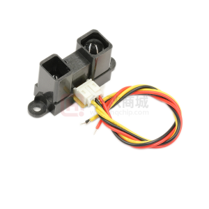
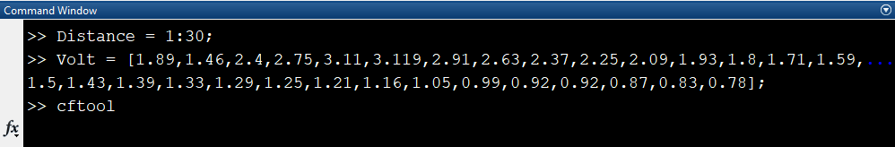
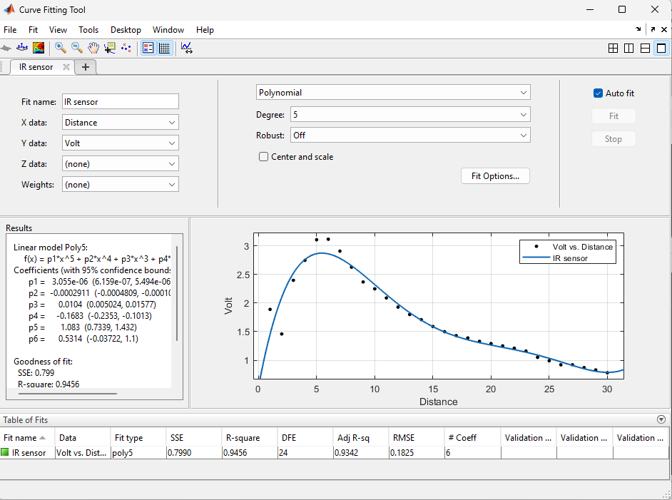

# Table of Contents {#table-of-contents .TOC-Heading}

[List of Figures [1](#list-of-figures)](#list-of-figures)

[List of Tables [1](#list-of-tables)](#list-of-tables)

[Abstract [2](#_Toc162900246)](#_Toc162900246)

[Objectives [2](#_Toc162900247)](#_Toc162900247)

[Appearances [2](#appearances)](#appearances)

[Introduction [2](#introduction)](#introduction)

[Theory [3](#theory)](#theory)

[Calibration [3](#calibration)](#calibration)

[IR Sensor [3](#ir-sensor)](#ir-sensor)

[Working Principle [3](#working-principle)](#working-principle)

[Components of IR Sensors
[3](#components-of-ir-sensors)](#components-of-ir-sensors)

[Result [3](#result)](#result)

[Discussion and Conclusion
[5](#discussion-and-conclusion)](#discussion-and-conclusion)

# List of Figures

[Figure 1: IR sensor [3](#_Toc162900261)](#_Toc162900261)

[Figure 2:Curve fitting MATLAB code.
[4](#_Toc162900262)](#_Toc162900262)

[Figure 3: Curve fitting tool window.
[5](#_Toc162900263)](#_Toc162900263)

# List of Tables

[Table 1: Values for distance and output voltage
[4](#_Toc162900265)](#_Toc162900265)

[]{#_Toc162900246 .anchor}

# Abstract

In this experiment, we used a special sensor called an IR sensor. This
sensor checks how far away something is in front of it. It has three
wires: one red, one black, and one yellow. The red and black wires give
it power (10 volts). The yellow wire gives out a signal that changes
depending on how far away the object is. We tested it by putting an
object at different distances from 1 centimeter to 27 centimeters, each
time moving it 1 centimeter further away. Then, we noted down the signal
it gave out. After that, we used a computer program called MATLAB to
draw a line that shows how the signal changes with distance.

[]{#_Toc162900247 .anchor}Objectives

-   Calibrate a voltmeter using source and measure function.

-   Find the static characteristics for IR sensor.

# Appearances

-   **IR Sensor**: This device detects how far an object is from it. It
    has three wires: red and black for power (10 volts), and yellow for
    giving a signal that changes with distance. Place the object at
    different distances from 1 cm to 30 cm, increasing by 1 cm each
    time, and record the signal it gives out.

-   **NI ELVIS III**: This is a tool made for teaching engineering. It
    has important lab tools like an oscilloscope, function generator,
    digital multimeter, and power supply, all in one device. We use it
    mainly for power supply and measuring voltage.

-   **Ruler**: A flat piece of plastic marked with measurements, usually
    within a few millimeters of accuracy.

-   **Notebook**: A small book used to record measurements, especially
    the distances measured from the IR sensor using the ruler.

# Introduction

In this experiment, we wanted to find out how far an object was from us,
so we used an infrared (IR) sensor. This sensor is good at detecting
objects. It has three wires: the red wire connects to 5 volts, the black
wire to the ground, and the yellow wire gives a signal that changes
depending on how far away the object is.

The sensor has two parts: an IR transmitter and an IR receiver. The
transmitter sends out infrared radiation, which hits the object and
bounces back to the sensor. The sensor then measures how long it took
for the radiation to come back. We tested this sensor\'s range from 1
centimeter to 30 centimeters, recording the signal it gave out for each
centimeter.

This sensor works by using a method called triangulation. It measures
distance by looking at the angle of the bounced-back radiation. The
signal it gives out depends on how far away the object is.

# Theory

## Calibration

Calibration is a method used to check and adjust the accuracy of
measuring tools and devices. It works by comparing the measurements from
the device being calibrated with a known standard. The main aim of
calibration is to find and fix any differences between the device\'s
readings and the known values, making sure it gives correct and reliable
results.

Calibration is extremely important across different industries like
manufacturing, healthcare, and environmental monitoring. It guarantees
that instruments provide precise and consistent measurements, meeting
quality requirements. It\'s advisable to calibrate instruments regularly
to adjust for any changes in their performance over time.

## IR Sensor

An IR (infrared) sensor is a gadget that spots and gauges infrared
radiation in the area around it. Infrared radiation has wavelengths
longer than those of visible light, so people can\'t see it. IR sensors
find extensive use in many areas for tasks like sensing, communication,
and control.

# Working Principle

Emission: Certain IR sensors send out infrared radiation and then gauge
the reflected or emitted radiation to spot objects or changes in
temperature.

# Components of IR Sensors

1.  IR Source: This part emits infrared radiation, often using an IR LED
    (Light Emitting Diode).

2.  IR Detector: This component receives and senses the infrared
    radiation. It can be a photodiode, phototransistor, or an integrated
    circuit sensitive to IR.

3.  Signal Processing Circuitry: This circuit converts the detected
    infrared signals into electrical signals, making them usable for
    different purposes or interpretations.

{width="2.6666666666666665in"
height="2.2395833333333335in"}

[]{#_Toc162900261 .anchor}Figure 1: IR sensor

# Result

The recorded output voltage appears as follows:

  -----------------------------------------------------------------------
  Distance (cm)     Voltage (V)       Distance (cm)     Voltage (V)
  ----------------- ----------------- ----------------- -----------------
  1                 1.89              16                1.5

  2                 1.46              17                1.43

  3                 2.4               18                1.39

  4                 2.75              19                1.33

  5                 3.11              20                1.29

  6                 3.119             21                1.25

  7                 2.91              22                1.21

  8                 2.63              23                1.16

  9                 2.37              24                1.05

  10                2.25              25                0.99

  11                2.09              26                0.92

  12                1.93              27                0.92

  13                1.8               28                0.87

  14                1.71              29                0.83

  15                1.59              30                0.78
  -----------------------------------------------------------------------

  : []{#_Toc162900265 .anchor}Table 1: Values for distance and output
  voltage

Next, we input these values into MATLAB and open the curve fitting tool

{width="6.188194444444444in"
height="1.0168208661417324in"}

[]{#_Toc162900262 .anchor}Figure 2:Curve fitting MATLAB code.

In the curve fitting tool window, we select a 5-degree polynomial to fit
our curve

{width="6.045833333333333in"
height="4.208333333333333in"}

[]{#_Toc162900263 .anchor}Figure 3: Curve fitting tool window.

These are the parameters and the equation for the curve that we
obtained:

$$f(x) = \ p_{1}*x^{5} + p_{2}*x^{4} + p_{3}*x^{3} + p_{4}*x^{2} + p_{5}*x + p_{6}$$

Coefficients (with 95% confidence bounds):

$$p_{1} = 3.055e - 06$$

$$p_{2} = - 0.0002911$$

$$p_{3} = 0.0104$$

$$p_{4} = - 0.1683$$

$$p_{5} = 1.083\ $$

$$p_{6} = 0.5314\ $$

Note: In this equation, the R-square value is 0.9456. This indicates
that it\'s sufficient to prevent overfitting and significant errors
within our recorded range.

# Discussion and Conclusion

Rather than directly measuring distance, sensors gauge voltage
corresponding to specific distances. Our primary objective is to
correlate voltage values to distances. We systematically collected
distance data from 1 cm to 30 cm, recording the output voltage for each
1 cm increment. Graphical representation of the data reveals an inverse
relationship between output voltage and distance.

To derive the equation for the curve and exclude the dead region, we
employed a trend line analysis. Our findings indicate several key
characteristics of IR sensors:

-   Nonlinearity: The relationship between input and output follows a
    nonlinear curve.

-   Sensitivity: Smaller output values are generated as the distance
    increases.

In conclusion, IR sensors exhibit these distinctive traits, which are
crucial considerations in their practical application.
